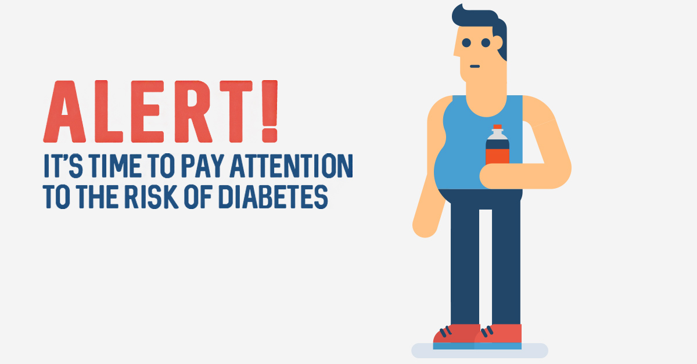

# Behavioral-Risk-Model-Predict-Diabetes
# Diabetes-Forecaster: Foresee Diabetes Risk and Prevention

Diabetes is one of the most common disease in the world. There are over 100 million people have (pre) diabetes in the United States. 90% people don't realize they have prediabetes symptoms. Diabetes-Forecaster aims to help people predict the risk of Type II Diabetes based on demographic and diet behavior. Here is the [web app!] (http://healthanalytics.club:5000) to check out your diabetes risk.

<<<<<<< HEAD

=======

>>>>>>> a894e02b1207f941bad7fb08b26d144022c5dfb9

